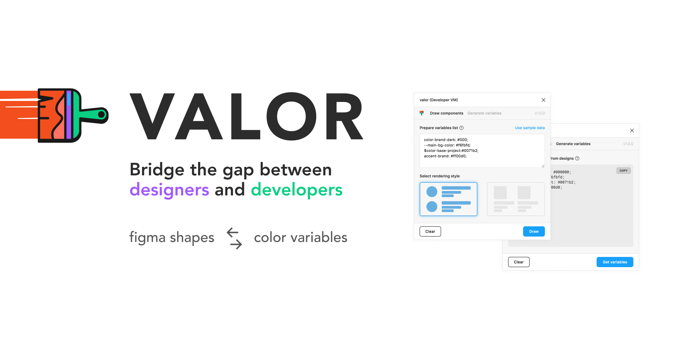

## Bridge the gap between designers and developers  
Visualise existing or new color palettes in your design system or Generate lists of variables from color palettes  

### Draw Components  
Import lists of color variables to draw components on canvas  
Visual options:  
- Horizontal orientation with circular shape
- Vertical orientation with square shape
- Color labels

### Generate variables
- Select shapes on a canvas to generate variables list
- Currently only rectangle or ellipse shapes are supported.
- Beware, shapes must be ungrouped and shape's name will be passed to variable name.

Variables lists can be copied to the clipboard

**More options will be available with new releases!**